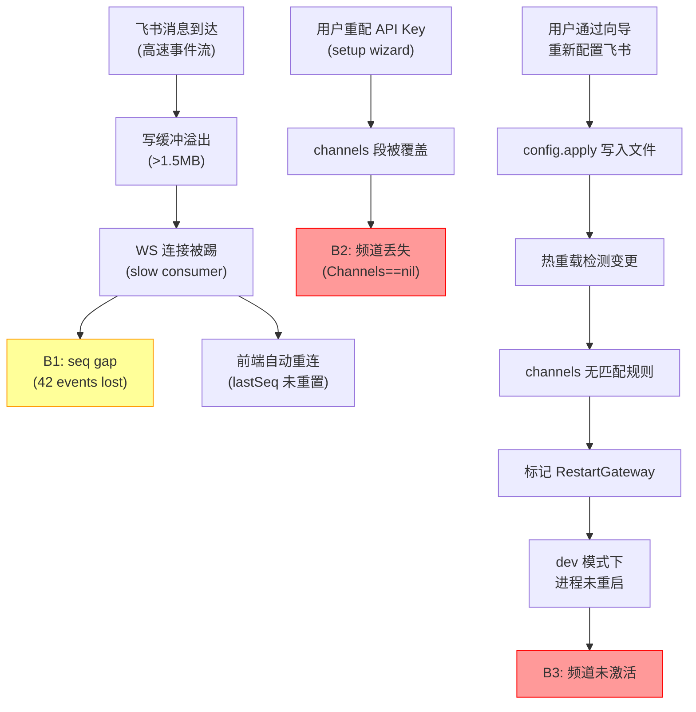

# Bug 报告：事件序列 Gap 检测 & 飞书频道丢失 & 频道热重载失效

- **日期**: 2026-03-02
- **严重级别**: 🔴 高（P1 — 影响核心通信链路）
- **影响范围**: Gateway 事件广播、飞书频道生命周期、频道配置热重载
- **复现条件**: 长时间运行 Gateway + 飞书消息触发 + 向导重新配置频道

---

## 一、Bug 概述

本次发现 **3 个关联 Bug**，均在同一次 Gateway 长时间运行（5h+）后暴露：

| # | Bug 名称 | 严重度 | 类型 |
|---|---------|--------|------|
| B1 | 事件序列 Gap（seq 跳跃 42） | 🟡 中 | 架构缺陷 |
| B2 | 重启后飞书频道丢失 | 🔴 高 | 配置管理 Bug |
| B3 | 向导配置频道后不激活 | 🔴 高 | 热重载遗漏 Bug |

---

## 二、Bug B1：事件序列 Gap 检测

### 现象

前端控制台报错：

```
event gap detected (expected seq 668, got 710); refresh recommended
```

42 个事件帧（seq 668~709）丢失。

### 根因分析

#### 直接原因：慢消费者丢弃机制（DropIfSlow）

[broadcast.go:156-205](file:///Users/fushihua/Desktop/OpenAcosmi-rust+go/backend/internal/gateway/broadcast.go#L156-L205) 中：

```go
// seq 在广播前已递增（原子操作）
v := b.seq.Add(1)
seqVal = &v

// 但如果客户端消费慢，事件被静默丢弃
if slow && dropIfSlow {
    continue  // ← seq 已消耗，但事件没发出去
}
```

所有 agent 事件都带 `DropIfSlow: true`（[chat.go:215](file:///Users/fushihua/Desktop/OpenAcosmi-rust+go/backend/internal/gateway/chat.go#L215)）。

#### 触发链（来自终端日志）

| 时间 | 事件 |
|------|------|
| 13:47:35.367 | 飞书消息到达，触发密集事件广播 |
| 13:47:38.240 | **WS 断连** — 后端因写缓冲溢出（>1.5MB）主动 close 连接 |
| 13:47:38.240 | dispatch_inbound 启动，后端继续广播（客户端已离线） |
| 13:47:39.053 | 前端自动重连 |
| 13:47:39.059 | hello-ok 发送，新连接建立 |

#### 辅助原因：前端 `lastSeq` 重连后未重置

[gateway.ts:114](file:///Users/fushihua/Desktop/OpenAcosmi-rust+go/ui/src/ui/gateway.ts#L114) 中 `lastSeq` 是实例属性，重连时复用同一个 `GatewayBrowserClient` 实例，`lastSeq` 保留旧值。新连接收到的第一个事件 seq=710，对比 `lastSeq`(667) → gap detected。

### 影响

- 不影响功能（前端在 `onHello` 回调中通过 snapshot 同步最新状态）
- 仅产生告警级别的错误提示

### 修复建议

1. **短期**：在 `onHello` 回调（[app-gateway.ts:173](file:///Users/fushihua/Desktop/OpenAcosmi-rust+go/ui/src/ui/app-gateway.ts#L173)）中重置 `lastSeq`（或在 `GatewayBrowserClient.connect()` 中重置）
2. **中期**：引入服务端事件重放缓冲（replay buffer），客户端断连重连后请求缺失事件
3. **长期**：将 seq 分配延迟到实际发送成功后，而非广播前

---

## 三、Bug B2：重启后飞书频道丢失

### 现象

用户重新配置 API Key 后重启 Gateway，飞书频道消失，前端频道列表为空。

### 根因分析

#### 配置文件缺少 `channels` 段

[server.go:1870-1872](file:///Users/fushihua/Desktop/OpenAcosmi-rust+go/backend/internal/gateway/server.go#L1870-L1872) 中频道注册的入口条件：

```go
if !config.SkipChannels && loadedCfg != nil && loadedCfg.Channels != nil {
    if loadedCfg.Channels.Feishu != nil {
        // 注册飞书插件
    }
}
```

重启前的 `openacosmi.json` 内容：

```json
{
  "models": { "providers": { "google": { ... } } },
  "agents": { ... },
  "gateway": { "mode": "local" }
  // ← 完全没有 "channels" 字段！
}
```

`loadedCfg.Channels` 为 nil → 整个频道注册代码块被跳过。

#### 产生原因

用户通过 setup wizard 重新配置 API Key 时，wizard 只写入了 `models/agents/gateway` 等字段，**没有保留原有的 `channels` 配置**。频道配置在重写过程中被丢弃。

这暴露了一个更深层的问题：**所有频道状态完全依赖内存**（`Manager` 的 `plugins`/`running`/`snapshots` 都是 `map`），没有持久化层，一旦配置文件中的 channels 段丢失，重启后无法恢复。

### 影响

- 🔴 飞书/钉钉/企微等所有频道全部丢失
- 网页版不受影响（Web 频道不依赖 `channels` 配置）

### 修复建议

1. **根本修复**：Setup wizard 在重写配置时，应 **合并**（merge）而非覆盖（overwrite），保留已有的 `channels` 段
2. **防御性修复**：在 `WriteConfigFile` 中添加配置段保护逻辑，防止关键段（channels、hooks 等）被意外删除

---

## 四、Bug B3：向导配置频道后不激活（热重载遗漏）

### 现象

用户通过频道配置向导填写飞书 appId/appSecret 后，配置已正确写入 `openacosmi.json`，但飞书 WebSocket 没有连接，终端无任何飞书相关日志输出。**必须手动重启 Gateway 才能生效。**

### 根因分析

#### 热重载规则中 `channels` 缺少动作

[reload.go:64-95](file:///Users/fushihua/Desktop/OpenAcosmi-rust+go/backend/internal/gateway/reload.go#L64-L95) 的完整规则列表：

```go
var baseReloadRules = []reloadRule{
    {prefix: "hooks.gmail", kind: ruleHot, actions: []string{"restart-gmail-watcher"}},
    {prefix: "hooks",       kind: ruleHot, actions: []string{"reload-hooks"}},
    {prefix: "cron",        kind: ruleHot, actions: []string{"restart-cron"}},
    {prefix: "browser",     kind: ruleHot, actions: []string{"restart-browser-control"}},
    // ← 没有 channels 规则！
}
var tailReloadRules = []reloadRule{
    {prefix: "models",  kind: ruleNone},
    {prefix: "agents",  kind: ruleNone},
    {prefix: "gateway", kind: ruleRestart},
    // ← channels 也不在这里！
}
```

#### 触发链

1. 向导保存配置 → `config.apply` 方法写入 `openacosmi.json`
2. 热重载系统检测到 `channels.feishu.*` 变更
3. `matchRule("channels.feishu.appId", ...)` 返回 **nil**（无匹配规则）
4. `BuildReloadPlan` 因 rule==nil 标记 `RestartGateway=true`
5. `ScheduleRestart()` 尝试重启：
   - 写入 restart sentinel 文件
   - 关闭所有 WebSocket 连接（code 1012）
   - **但在 `make gateway-dev` 开发模式下，进程不会自动重启**
6. 前端检测到 WS 断连 → 自动重连 → 后端进程未重启 → 频道插件从未注册

#### 根本问题

**频道插件的注册和启动只在 `server.go` 初始化阶段执行一次**（[server.go:1870-2368](file:///Users/fushihua/Desktop/OpenAcosmi-rust+go/backend/internal/gateway/server.go#L1870-L2368)），没有运行时热重载路径。与 hooks/cron/heartbeat 不同，channels 缺失独立的 `restart-channel:*` action。

### 影响

- 🔴 通过向导配置的任何新频道都不会立即生效
- 用户体验断裂：向导提示配置成功，但频道实际未启动

### 修复建议

**方案 A — 添加频道热重载 action**（推荐）：

```go
// reload.go: 在 baseReloadRules 中添加
{prefix: "channels", kind: ruleHot, actions: []string{"restart-channels"}},
```

```go
// applyReloadAction 中添加
case "restart-channels":
    plan.RestartChannels["all"] = struct{}{}
```

然后在 `OnHotReload` 回调中实现频道的 stop → re-register → start 流程。

**方案 B — 简化为重启**：

```go
// tailReloadRules 中添加
{prefix: "channels", kind: ruleRestart},
```

确保 `make gateway-dev` 模式能正确响应 restart sentinel。

---

## 五、Bug 关联关系



---

## 六、影响评估

| 维度 | 评估 |
|------|------|
| **用户影响** | 高 — 飞书等核心频道在配置变更后完全不可用 |
| **数据丢失** | 无 — 消息记录在 transcript 中持久化 |
| **安全风险** | 无 |
| **复现概率** | 100% — 任何通过向导配置频道的操作都会触发 |

## 七、建议修复优先级

1. 🔴 **B3**（频道热重载）— 最影响日常使用，修复成本低
2. 🔴 **B2**（频道配置丢失）— 需要修改 wizard 的配置写入逻辑
3. 🟡 **B1**（seq gap）— 影响较小，属于架构优化
